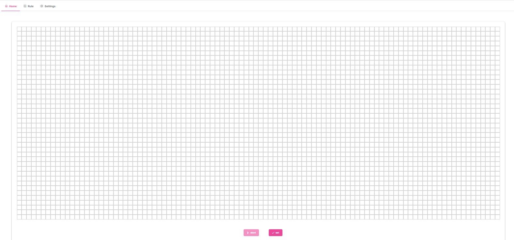
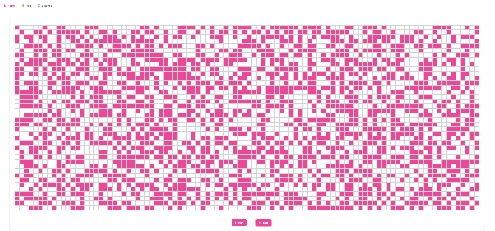
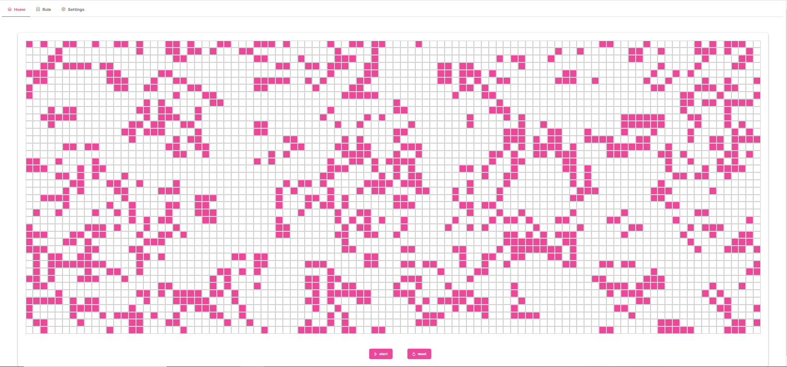
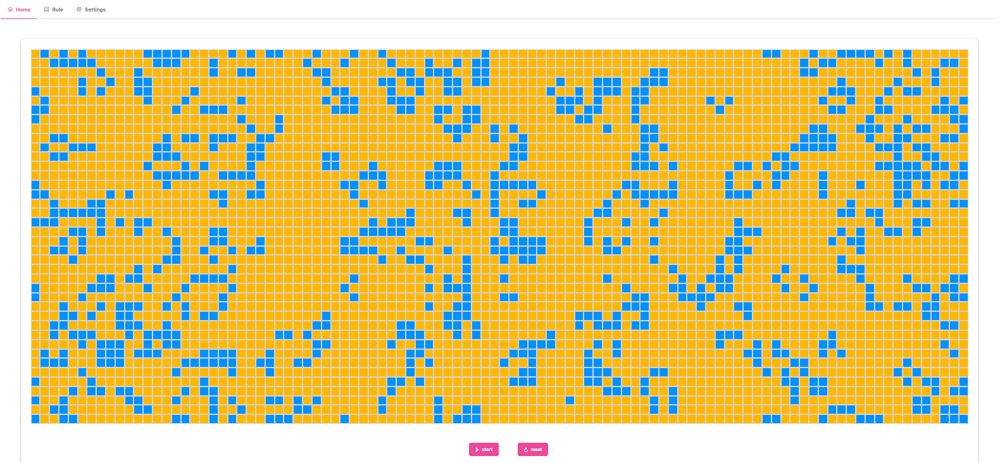

# lifegame
## About lifegame
The Game of Life, devised by mathematician John Conway in the 1970s, is a simulation that models the evolution of cells on a grid. Here's a breakdown:
Grid Setup:
It's played on a grid, usually a square, with cells arranged in rows and columns. Each cell can either be alive or dead.

Rules of Evolution:
- Underpopulation: Any live cell with fewer than two live neighbors dies in the next generation due to loneliness.
- Sustainability: A live cell with two or three live neighbors survives to the next generation.
- Overpopulation: Any live cell with more than three live neighbors dies from overcrowding.
- Reproduction: A dead cell with exactly three live neighbors becomes a live cell, simulating reproduction.

① initial



② push 'reset'



③ push 'start'



④ change color and period



## Project setup
```
npm install
```

### Compiles and hot-reloads for development
```
npm run serve
```

### Compiles and minifies for production
```
npm run build
```

### Lints and fixes files
```
npm run lint
```

### Execute test
```
npm run test:unit
```

